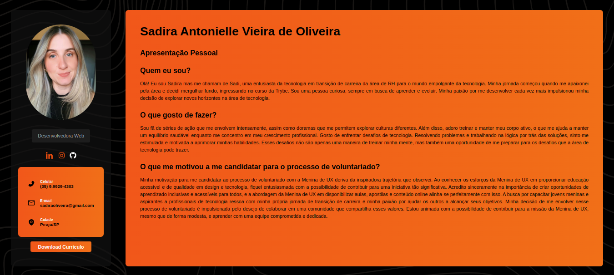

# Portfólio Pessoal - Sadira Oliveira

Este é o repositório do meu portfólio pessoal, onde compartilho informações sobre mim, meus projetos e habilidades. O portfólio é uma página web desenvolvida utilizando React e CSS, e apresenta uma interface responsiva e atraente para mostrar meu perfil como desenvolvedora.

## Tecnologias Utilizadas

- React: Biblioteca JavaScript para construção de interfaces de usuário.
- CSS: Linguagem de estilização para a aparência visual do portfólio.

## Funcionalidades

- Apresentação pessoal: Uma breve introdução sobre mim e minha jornada na área de tecnologia.
- Interesses: Destaco meus interesses e atividades no tempo livre, incluindo meu gosto por desafios de programação.
- Motivação para o Voluntariado: Compartilho minha motivação para participar de projetos voluntários relacionados à tecnologia.
- Redes Sociais: Ícones linkados para as minhas redes sociais (LinkedIn, GitHub, Instagram).

